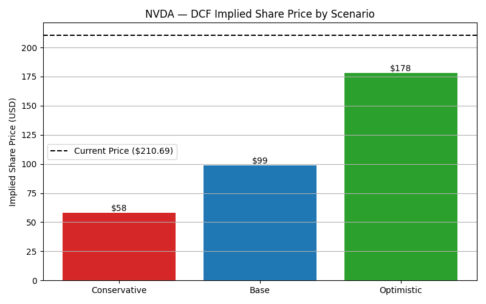
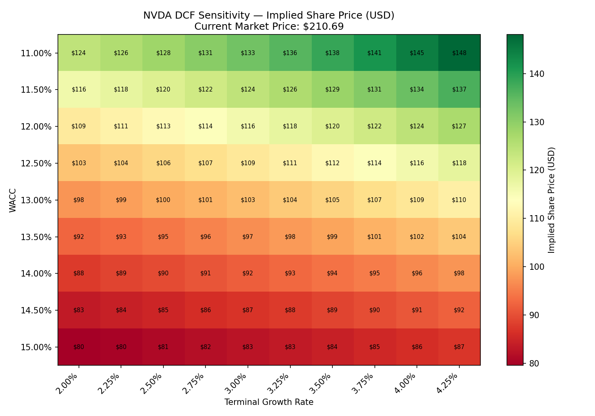

# Institutional Investment Research Platform

An equity research and valuation platform that replicates the analytical workflow used by investment analysts, asset managers and hedge funds — from financial statement analysis to forecasting, DCF valuation and risk assessment.

Initial coverage: **NVIDIA (NVDA)**. Designed to scale to the largest AI-driven companies (Microsoft, Alphabet, Amazon, Meta) as the platform matures.

---

## Current State

The platform currently runs a full single-company valuation pipeline end-to-end:

```
Financial Data API (yfinance)
        ↓
   Data Ingestion (data_loader.py)
        ↓
   Financial Statement Analysis
   - Income Statement: revenue growth, margins (visualization.py)
   - Balance Sheet & Cash Flow: liquidity, solvency, returns, cash efficiency
     (balance_sheet_analysis.py)
        ↓
   Cost of Capital Estimation (beta_and_wacc.py)
   - Beta via daily-return regression vs. S&P 500
   - Beta as reported by yfinance
   - WACC computed under both methodologies
        ↓
   DCF Valuation — 3 Scenarios, 10-Year Horizon (dcf_model.py)
   - Conservative / Base / Optimistic
        ↓
   Sensitivity Analysis (sensitivity_analysis.py)
   - Implied share price across WACC × Terminal Growth grid
```

This is not a single script — it's a chain of five modules that each consume the previous step's output, mirroring how an actual equity research workflow is structured.

---

## Key Findings — NVIDIA (NVDA)

**Financial health:** NVIDIA's balance sheet shows very low leverage (Debt-to-Equity fell from 0.54 in FY2023 to 0.07 in FY2026) and strong cash conversion (80–91% of net income converts to free cash flow). ROE peaked near 92% in FY2025 before moderating to 76% in FY2026 — exceptional capital efficiency, achieved with almost no debt financing.

**Cost of capital:** NVIDIA's beta is estimated at **1.82** (10-year daily regression vs. S&P 500) or **2.20** (yfinance reported), producing a WACC range of **12.5%–14.2%** depending on methodology. The capital structure is over 99% equity-financed, so WACC is almost entirely driven by the cost of equity.

**DCF valuation (10-year horizon):**

| Scenario | Year 1 → Year 10 FCF Growth | Terminal Growth | WACC | Implied Share Price |
|---|---|---|---|---|
| Conservative | 15% → 4% | 2.5% | 14.2% | $57.87 |
| Base | 25% → 6% | 3.0% | 13.3% | $98.70 |
| Optimistic | 35% → 9% | 3.5% | 12.5% | $178.07 |

**Current market price: ~$210.69**

**The central finding:** even the Optimistic scenario — which assumes aggressive but not unreasonable double-digit FCF growth sustained for a full decade — lands roughly 15% below the current market price. Under the Base scenario, the gap widens to over 50%. Sensitivity analysis confirms that **the growth assumption, not WACC or terminal growth, is the dominant driver of this valuation**: across the entire tested grid of WACC (11%–15%) and terminal growth (2.0%–4.25%) at the Base growth profile, no combination produces a price above $148 — still 30% short of market.

This suggests the market is pricing in either (a) growth durability beyond the 10-year horizon modeled here, or (b) a premium that goes beyond what a traditional discounted cash flow framework captures — a live debate in how AI infrastructure companies are being valued in the current cycle.

*Full methodology, assumptions, and caveats are documented in each module below.*

---

## Sample Output




*(Additional charts — revenue growth, margins, liquidity/solvency ratios, beta regression, FCF projections — are generated in `images/`.)*

---

## How to Run

```bash
# 1. Clone and enter the project
git clone <repo-url>
cd institutional-investment-research-platform

# 2. Create a virtual environment and install dependencies
python -m venv venv
venv\Scripts\activate          # Windows
pip install -r requirements.txt

# 3. Pull the latest financial data (income statement, balance sheet, cash flow, price history, S&P 500 benchmark)
python src/data_loader.py

# 4. Run the analysis modules in sequence
python src/visualization.py          # Income statement: growth & margins
python src/balance_sheet_analysis.py # Balance sheet & cash flow: liquidity, solvency, returns
python src/beta_and_wacc.py          # Cost of capital: beta (2 methods) & WACC
python src/dcf_model.py              # DCF valuation: 3 scenarios, 10-year horizon
python src/sensitivity_analysis.py   # Sensitivity grid: WACC × Terminal Growth
```

All charts are saved automatically to `images/`.

---

## Technology Stack

**In use today:**
* Python
* pandas / NumPy
* Matplotlib
* yfinance (financial data API)

**Planned (see roadmap):**
* PostgreSQL — structured storage for multi-company coverage
* SQLAlchemy — database ORM layer
* Plotly — interactive charting
* Streamlit — investment dashboard

---

## Methodology Notes & Limitations

Transparency on assumptions matters as much as the model itself:

* **Beta divergence:** the 10-year daily regression beta (1.82) and yfinance's reported beta (2.20) likely differ due to estimation window — yfinance probably weights a shorter, more recent (and more volatile) period more heavily. Both are reported rather than picking one as "correct."
* **Cost of debt** is calculated from FY2025 interest paid and total debt, as FY2026 interest data was not yet available from the data source at time of analysis.
* **Risk-free rate (4.3%) and equity risk premium (4.5%)** are fixed approximations of prevailing 10-year Treasury yield and U.S. equity risk premium, not pulled live from a market data feed — a known simplification versus a production-grade system.
* **Terminal value sensitivity:** in the Optimistic scenario, the present value of the terminal value represents roughly 57% of total enterprise value — a reminder that any DCF of a high-growth company is inherently a bet on assumptions about a distant, hard-to-predict future, not just near-term fundamentals.
* **Data source:** all financials are sourced via `yfinance`, which is sufficient for portfolio-grade analysis but less rigorous than institutional data feeds (Bloomberg, FactSet, CapitalIQ) used in production research settings.

---

## Development Roadmap

### ✅ Phase 1 — Data Infrastructure & Financial Analysis (Complete)
- [x] Automated financial statement ingestion (income statement, balance sheet, cash flow, price history)
- [x] Revenue growth, gross/operating/net margin calculations
- [x] Liquidity, solvency, returns, and cash efficiency ratios
- [x] Automated chart generation
- [ ] PostgreSQL database design for multi-company storage

### ✅ Phase 2 — Cost of Capital (Complete)
- [x] Beta estimation via daily-return regression vs. S&P 500
- [x] Beta cross-check via yfinance reported figure
- [x] WACC computed under both methodologies

### ✅ Phase 3 — Valuation (Complete)
- [x] 10-year revenue/FCF forecasting with growth fade
- [x] Discounted Cash Flow (DCF) model — 3 scenarios (Conservative / Base / Optimistic)
- [x] Sensitivity analysis (WACC × Terminal Growth grid)

### Phase 4 — Multi-Company Coverage
- [ ] Extend pipeline to Microsoft, Alphabet, Amazon, Meta
- [ ] Comparative analysis across AI infrastructure vs. AI application companies
- [ ] Sector-level benchmarking (margins, capex intensity, R&D spend)

### Phase 5 — Risk Analytics
- [ ] Monte Carlo simulation for intrinsic value distribution
- [ ] Probability-weighted scenario outcomes
- [ ] Risk scoring framework

### Phase 6 — Reporting & Delivery
- [ ] Interactive Streamlit dashboard
- [ ] Automated PDF investment reports
- [ ] Investment recommendation engine

---

## Investment Workflow

1. Collect financial statements (income statement, balance sheet, cash flow, price history)
2. Clean and validate data
3. Analyze financial performance (margins, growth, liquidity, solvency, returns)
4. Estimate cost of capital (beta, WACC) under multiple methodologies
5. Forecast free cash flows under multiple growth scenarios
6. Estimate intrinsic value using DCF
7. Stress-test valuation via sensitivity analysis
8. *(Planned)* Run Monte Carlo simulations for full valuation distribution
9. *(Planned)* Generate investment recommendation

---

## Why This Project

Public equity research on AI-driven companies requires the same analytical discipline as traditional FP&A or credit analysis — financial statement fluency, forecasting judgment, and the ability to translate numbers into a defensible investment view. This project demonstrates that workflow end-to-end: starting from raw financial data, through cost-of-capital estimation under competing methodologies, to a fully reasoned DCF valuation that is stress-tested rather than taken at face value — including an honest accounting of where the model's conclusions diverge from the market, and why.