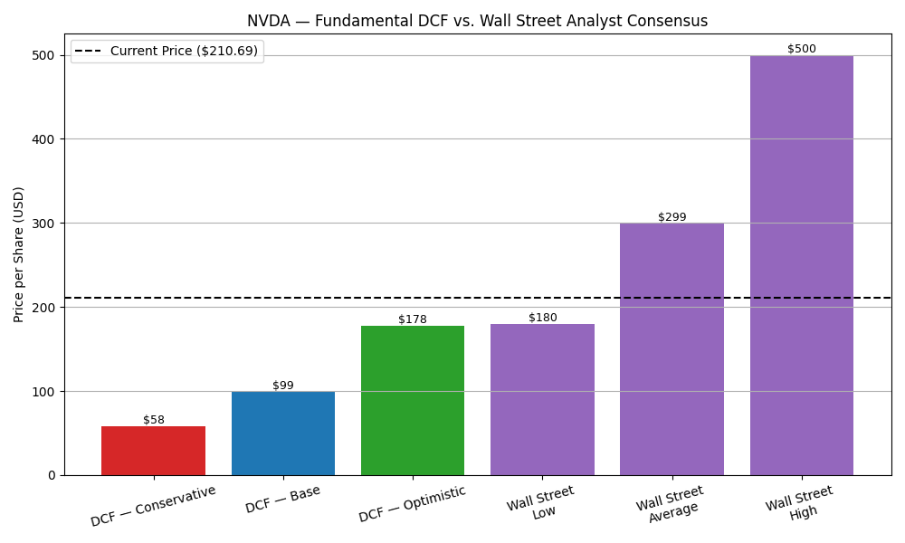
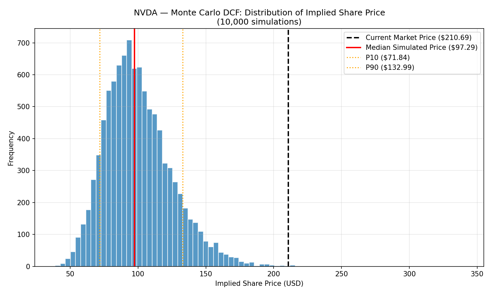

# Institutional Investment Research Platform

An equity research and valuation platform that replicates the analytical workflow used by investment analysts, asset managers and hedge funds — from financial statement analysis to forecasting, DCF valuation and risk assessment.

Initial coverage: **NVIDIA (NVDA)**. Designed to scale to the largest AI-driven companies (Microsoft, Alphabet, Amazon, Meta) as the platform matures.

---

## Current State

The platform currently runs a full single-company valuation pipeline end-to-end:

```
Financial Data API (yfinance)
        ↓
   Data Ingestion (data_loader.py)
        ↓
   Financial Statement Analysis
   - Income Statement: revenue growth, margins (visualization.py)
   - Balance Sheet & Cash Flow: liquidity, solvency, returns, cash efficiency
     (balance_sheet_analysis.py)
        ↓
   Cost of Capital Estimation (beta_and_wacc.py)
   - Beta via 10-year daily-return regression vs. S&P 500
   - Beta via 3-year daily-return regression (isolates the AI-infrastructure era)
   - Beta as reported by yfinance
   - WACC computed under all three methodologies
        ↓
   DCF Valuation — 4 Scenarios, 10-Year Horizon (dcf_model.py)
   - Conservative / Base / Base (3-Year Beta) / Optimistic
        ↓
   Sensitivity Analysis (sensitivity_analysis.py)
   - Implied share price across WACC × Terminal Growth grid
        ↓
   Analyst Consensus Comparison (analyst_consensus_comparison.py)
   - DCF-implied prices vs. Wall Street price targets
        ↓
   Monte Carlo Simulation (monte_carlo.py)
   - 10,000-trial probabilistic DCF
   - Probability that intrinsic value exceeds market price
```

This is not a single script — it's a chain of modules that each consume the previous step's output, mirroring how an actual equity research workflow is structured.

---

## Key Findings — NVIDIA (NVDA)

**Financial health:** NVIDIA's balance sheet shows very low leverage (Debt-to-Equity fell from 0.54 in FY2023 to 0.07 in FY2026) and strong cash conversion (80–91% of net income converts to free cash flow). ROE peaked near 92% in FY2025 before moderating to 76% in FY2026 — exceptional capital efficiency, achieved with almost no debt financing.

**Cost of capital — three beta methodologies:**

| Methodology | Beta | WACC |
|---|---|---|
| 10-year daily regression vs. S&P 500 | 1.82 | 12.47% |
| 3-year daily regression vs. S&P 500 | 2.11 | 13.78% |
| yfinance reported | 2.20 | 14.19% |

The pattern is consistent: shorter, more recent windows produce a higher beta. This makes financial sense — NVIDIA's business has shifted structurally over the past decade, from a gaming/crypto-cyclical GPU maker to an AI infrastructure monopoly, and a 10-year window blends both eras into a single (lower) volatility estimate. The 3-year beta likely better reflects the risk profile of the business *as it exists today*. The capital structure is over 99% equity-financed, so WACC is almost entirely driven by the cost of equity regardless of methodology.

**DCF valuation (10-year horizon, 4 scenarios):**

| Scenario | Year 1 → Year 10 FCF Growth | Terminal Growth | WACC | Implied Share Price |
|---|---|---|---|---|
| Conservative | 15% → 4% | 2.5% | 14.2% (yfinance beta) | $57.87 |
| Base | 25% → 6% | 3.0% | 13.3% (avg. of 10yr & yfinance beta) | $98.70 |
| Base (3-Year Beta) | 25% → 6% | 3.0% | 13.8% (3-year beta) | $93.83 |
| Optimistic | 35% → 9% | 3.5% | 12.5% (10-year beta) | $178.07 |

**Current market price: ~$210.69**

**The central finding:** even the Optimistic scenario — which assumes aggressive but not unreasonable double-digit FCF growth sustained for a full decade — lands roughly 15% below the current market price. Under the Base scenario, the gap widens to over 50%, and using the more recent (arguably more representative) 3-year beta widens it further still — confirming that adopting the methodologically stronger beta makes NVIDIA look *more*, not less, expensive on a fundamentals basis. Sensitivity analysis confirms that **the growth assumption, not WACC or terminal growth, is the dominant driver of this valuation**: across the entire tested grid of WACC (11%–15%) and terminal growth (2.0%–4.25%) at the Base growth profile, no combination produces a price above $148 — still 30% short of market.

**Comparison against Wall Street consensus:** as of June 2026, the Wall Street analyst consensus on NVDA (62 analysts, "Strong Buy" rating) carries an average 12-month price target of **$298.93**, with a low of **$180** and a high of **$500**. Notably, this DCF's Optimistic scenario ($178.07) sits almost exactly at the *lowest* end of the Wall Street range — meaning even the most aggressive fundamentals-based scenario modeled here roughly matches the most bearish sell-side analyst, while the sell-side average assumes substantially more upside than a traditional DCF framework can justify from current financials alone.

This suggests the market — and Wall Street analysts — are pricing in either (a) growth durability beyond the 10-year horizon modeled here, (b) margin and competitive-moat durability beyond what this model assumes, or (c) a premium that goes beyond what a traditional discounted cash flow framework captures — a live debate in how AI infrastructure companies are being valued in the current cycle.

**Monte Carlo simulation (10,000 trials):** rather than relying on four discrete scenarios, a Monte Carlo simulation draws WACC, FCF growth (Year 1 and Year 10), and terminal growth from probability distributions anchored to the ranges explored above, then runs the full DCF 10,000 times. The resulting distribution of implied share prices has a median of **$97.29** (mean $100.36, std. dev. $24.76), with a 10th–90th percentile range of **$71.84–$132.99**. Under this framework, **only 0.1% of simulated outcomes exceed the current market price of $210.69** — meaning the market price sits far into the right tail of the distribution of fundamentally-justified values modeled here.

*Important caveat: this does not "prove" NVIDIA is overvalued with 99.9% confidence — it shows that, within this specific 10-year DCF framework (bounded terminal growth, beta-derived WACC, historically-anchored growth fade), almost no combination of reasonable inputs reaches the current price. The gap is better read as evidence that the market is pricing in either growth durability beyond this model's 10-year horizon, or a structural premium that a traditional DCF is not designed to capture — not as a forecast of price direction.*

*Full methodology, assumptions, and caveats are documented in each module below.*

---

## Sample Output





*(Additional charts — revenue growth, margins, liquidity/solvency ratios, beta regression, WACC comparison, FCF projections — are generated in `images/`.)*

---

## How to Run

```bash
# 1. Clone and enter the project
git clone <repo-url>
cd institutional-investment-research-platform

# 2. Create a virtual environment and install dependencies
python -m venv venv
venv\Scripts\activate          # Windows
pip install -r requirements.txt

# 3. Pull the latest financial data (income statement, balance sheet, cash flow, price history, S&P 500 benchmark)
python src/data_loader.py

# 4. Run the analysis modules in sequence
python src/visualization.py                  # Income statement: growth & margins
python src/balance_sheet_analysis.py          # Balance sheet & cash flow: liquidity, solvency, returns
python src/beta_and_wacc.py                   # Cost of capital: beta (3 methods) & WACC
python src/dcf_model.py                       # DCF valuation: 4 scenarios, 10-year horizon
python src/sensitivity_analysis.py            # Sensitivity grid: WACC × Terminal Growth
python src/analyst_consensus_comparison.py    # DCF vs. Wall Street analyst consensus
python src/monte_carlo.py                     # 10,000-trial Monte Carlo simulation
```

All charts are saved automatically to `images/`.

---

## Technology Stack

**In use today:**
* Python
* pandas / NumPy
* Matplotlib
* yfinance (financial data API)

**Planned (see roadmap):**
* PostgreSQL — structured storage for multi-company coverage
* SQLAlchemy — database ORM layer
* Plotly — interactive charting
* Streamlit — investment dashboard

---

## Methodology Notes & Limitations

Transparency on assumptions matters as much as the model itself:

* **Beta methodology and structural change:** three betas were calculated (10-year regression, 3-year regression, yfinance-reported) and consistently show that shorter, more recent windows produce a higher beta (1.82 → 2.11 → 2.20). This is consistent with NVIDIA's shift from a gaming/crypto-cyclical GPU maker to an AI infrastructure company — a 10-year window mixes both eras and likely understates current-era risk. The 3-year beta is treated as a credible alternative, not a replacement, and is carried through to a dedicated DCF scenario.
* **Cost of debt** is calculated from FY2025 interest paid and total debt, as FY2026 interest data was not yet available from the data source at time of analysis.
* **Risk-free rate (4.3%) and equity risk premium (4.5%)** are fixed approximations of prevailing 10-year Treasury yield and U.S. equity risk premium, not pulled live from a market data feed — a known simplification versus a production-grade system.
* **Terminal value sensitivity:** in the Optimistic scenario, the present value of the terminal value represents roughly 57% of total enterprise value — a reminder that any DCF of a high-growth company is inherently a bet on assumptions about a distant, hard-to-predict future, not just near-term fundamentals.
* **Monte Carlo distribution choices:** WACC, FCF growth, and terminal growth are each modeled as Normal distributions (terminal growth additionally truncated to 2.0%–4.0%) anchored to the ranges explored in the four deterministic scenarios. A simulation-level safety constraint caps terminal growth at least 1 percentage point below that simulation's own WACC draw, preventing the Gordon Growth Model from mathematically exploding on extreme draws. A fixed random seed (42) makes results reproducible across runs.
* **Wall Street consensus figures** ($298.93 average, $180–$500 range, 62 analysts) were sourced from public aggregators (S&P Global Market Intelligence / TipRanks, via stockanalysis.com) as of mid-June 2026 and are hardcoded in `analyst_consensus_comparison.py` — they will drift out of date and should be refreshed periodically rather than treated as live data.
* **Data source:** all financials are sourced via `yfinance`, which is sufficient for portfolio-grade analysis but less rigorous than institutional data feeds (Bloomberg, FactSet, CapitalIQ) used in production research settings.

---

## Development Roadmap

### ✅ Phase 1 — Data Infrastructure & Financial Analysis (Complete)
- [x] Automated financial statement ingestion (income statement, balance sheet, cash flow, price history)
- [x] Revenue growth, gross/operating/net margin calculations
- [x] Liquidity, solvency, returns, and cash efficiency ratios
- [x] Automated chart generation
- [ ] PostgreSQL database design for multi-company storage

### ✅ Phase 2 — Cost of Capital (Complete)
- [x] Beta estimation via daily-return regression vs. S&P 500
- [x] Beta cross-check via yfinance reported figure
- [x] WACC computed under both methodologies

### ✅ Phase 3 — Valuation (Complete)
- [x] 10-year revenue/FCF forecasting with growth fade
- [x] Discounted Cash Flow (DCF) model — 4 scenarios (Conservative / Base / Base 3-Year Beta / Optimistic)
- [x] Sensitivity analysis (WACC × Terminal Growth grid)
- [x] Benchmarking against Wall Street analyst consensus

### Phase 4 — Multi-Company Coverage
- [ ] Extend pipeline to Microsoft, Alphabet, Amazon, Meta
- [ ] Comparative analysis across AI infrastructure vs. AI application companies
- [ ] Sector-level benchmarking (margins, capex intensity, R&D spend)

### ✅ Phase 5 — Risk Analytics (Complete)
- [x] Monte Carlo simulation for intrinsic value distribution (10,000 trials)
- [x] Probability that intrinsic value exceeds current market price
- [ ] Probability-weighted scenario outcomes (bull/base/bear blended)
- [ ] Risk scoring framework

### Phase 6 — Reporting & Delivery
- [ ] Interactive Streamlit dashboard
- [ ] Automated PDF investment reports
- [ ] Investment recommendation engine

---

## Investment Workflow

1. Collect financial statements (income statement, balance sheet, cash flow, price history)
2. Clean and validate data
3. Analyze financial performance (margins, growth, liquidity, solvency, returns)
4. Estimate cost of capital (beta, WACC) under multiple methodologies
5. Forecast free cash flows under multiple growth scenarios
6. Estimate intrinsic value using DCF
7. Stress-test valuation via sensitivity analysis
8. *(Planned)* Run Monte Carlo simulations for full valuation distribution
9. *(Planned)* Generate investment recommendation

---

## Why This Project

Public equity research on AI-driven companies requires the same analytical discipline as traditional FP&A or credit analysis — financial statement fluency, forecasting judgment, and the ability to translate numbers into a defensible investment view. This project demonstrates that workflow end-to-end: starting from raw financial data, through cost-of-capital estimation under competing methodologies, to a fully reasoned DCF valuation that is stress-tested rather than taken at face value — including an honest accounting of where the model's conclusions diverge from the market, and why.